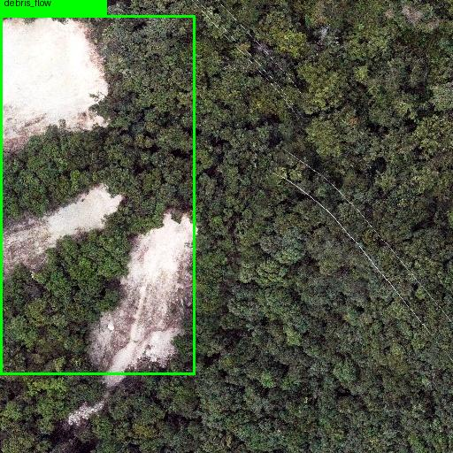
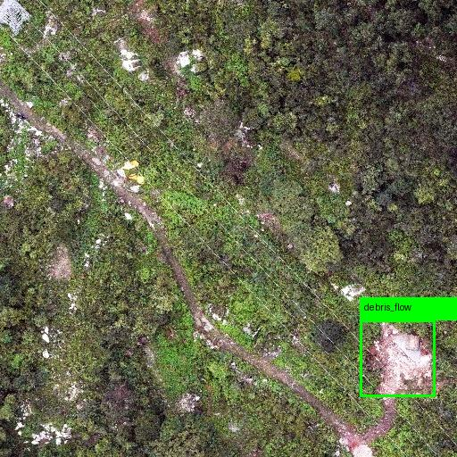
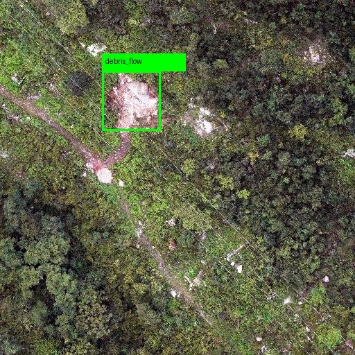
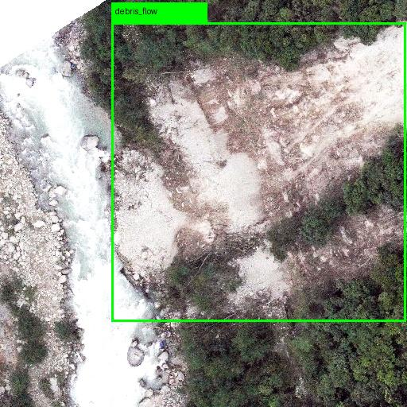

# GeoHazardDet - 泥石流/滑坡地质灾害识别项目

基于 YOLOv8 的地质灾害目标检测项目，用于识别航拍图像中的泥石流和滑坡区域。

**项目特色：高精度地质灾害识别**

---

## 项目简介

| 项目 | 说明 |
|------|------|
| **任务类型** | 目标检测 (Object Detection) |
| **模型框架** | YOLOv8 |
| **目标类别** | 2类 (泥石流、滑坡) |
| **数据集规模** | 1,635 张图片 |
| **图片尺寸** | 512 × 512 像素 |
| **应用场景** | 航拍图像地质灾害识别 |

### 类别信息

| ID | 名称 | 说明 |
|----|------|------|
| 0 | debris_flow | 泥石流 |
| 1 | landslide | 滑坡 |

---

## 运行效果 / Demo Results

以下是模型在验证集上的部分检测结果示例：

| 场景 1 | 场景 2 |
|:---:|:---:|
|  |  |
| **检测到滑坡/泥石流区域** | **复杂地形下的识别效果** |

| 场景 3 | 场景 4 |
|:---:|:---:|
|  |  |
| **不同尺度的目标检测** | **航拍视角下的灾害识别** |

---

## 致谢与声明

本项目基于 [Ultralytics YOLOv8](https://github.com/ultralytics/ultralytics) 框架开发。

- 本项目遵循原始框架的许可证协议 (AGPL-3.0)
- 感谢 Ultralytics 团队在计算机视觉领域的贡献
- 本项目在此基础上进行了地质灾害检测的特定优化和扩展

---

## 环境配置

### 1. 创建虚拟环境

```bash
# 使用 conda 创建虚拟环境
conda create -n geohazard python=3.10

# 激活虚拟环境
conda activate geohazard
```

### 2. 安装依赖

```bash
# 安装 ultralytics (包含 YOLOv8)
pip install ultralytics>=8.1.0

# 或使用 requirements.txt
pip install -r requirements.txt
```

### 3. requirements.txt 内容

```
ultralytics>=8.1.0,<8.3.0
torch>=2.0.0
torchvision>=0.15.0
numpy>=1.24.0
pandas>=2.0.0
Pillow>=10.0.0
opencv-python>=4.8.0
matplotlib>=3.7.0
seaborn>=0.12.0
tqdm>=4.65.0
PyYAML>=6.0
```

### 4. 验证 GPU 环境

```bash
# 检查 PyTorch 是否支持 GPU
python -c "import torch; print(f'CUDA available: {torch.cuda.is_available()}'); print(f'GPU count: {torch.cuda.device_count() if torch.cuda.is_available() else 0}')"
```

输出示例:
```
CUDA available: True
GPU count: 1
```

---

## 数据集说明

### 数据集目录结构

```
datasets/
├── images/
│   ├── train/ (1,144 张训练图片)
│   ├── val/ (327 张验证图片)
│   └── test/ (164 张测试图片)
└── labels/
    ├── train/ (1,144 个标签文件)
    ├── val/ (327 个标签文件)
    └── test/ (164 个标签文件)
```

### YOLO 标签格式

每个标签文件 (`.txt`) 包含一个或多个目标，格式如下：

```
<class_id> <x_center> <y_center> <width> <height>
```

**示例:**
```
0 0.635742 0.777344 0.724609 0.441406
```

**字段说明:**

| 字段 | 含义 | 范围 |
|------|------|------|
| class_id | 类别ID (0=泥石流, 1=滑坡) | 整数 |
| x_center | 目标中心X坐标 (归一化) | 0-1 |
| y_center | 目标中心Y坐标 (归一化) | 0-1 |
| width | 目标宽度 (归一化) | 0-1 |
| height | 目标高度 (归一化) | 0-1 |

### 数据集配置

配置文件: `configs/disaster.yaml`

```yaml
path: ./datasets
train: images/train
val: images/val
test: images/test
nc: 2
names:
  0: debris_flow
  1: landslide
```

---

## 快速开始

### 方式一：命令行训练

```bash
# 默认配置训练 (100轮, GPU 0)
python src/train.py

# 自定义参数
python src/train.py --epochs 200 --batch 8 --model yolov8s.pt
```

### 方式二：PyCharm 训练

详见 [PyCharm配置](#pycharm配置)

---

## PyCharm 配置

### 1. 打开项目

1. 打开 PyCharm
2. 选择 `File` → `Open`
3. 选择项目目录: `C:\...\GeoHazardDet`

### 2. 配置 Python 解释器

1. `File` → `Settings` → `Project: GeoHazardDet` → `Python Interpreter`
2. 点击齿轮图标 → `Add...`
3. 选择 `Existing environment`
4. 选择 conda 环境: `...\anaconda3\envs\geohazard\python.exe`
   (或你创建的其他虚拟环境)

### 3. 配置运行参数

1. 点击右上角 `Add Configuration...`
2. 点击 `+` → `Python`
3. 配置如下:

```
Name: Train Model
Script path: ...\GeoHazardDet\src\train.py
Parameters: (留空，使用默认参数)
Working directory: ...\GeoHazardDet
```

4. 点击 `OK` 保存

### 4. 默认训练参数

当参数留空时，使用以下默认值:

| 参数 | 默认值 | 说明 |
|------|--------|------|
| --epochs | 100 | 训练轮次 |
| --batch | 16 | 批次大小 |
| --device | 0 | GPU 编号 (0/1/... 或 cpu) |
| --model | yolov8n.pt | 预训练模型 |
| --data | configs/disaster.yaml | 数据集配置 |

### 5. 开始训练

1. 确保右上角选择了 `Train Model` 配置
2. 点击 ▶️ 按钮开始训练

### 6. 自定义 PyCharm 运行配置

如需自定义参数，编辑 `Parameters` 字段:

```
--epochs 200 --batch 8 --device 0 --model yolov8s.pt
```

---

## 模型训练

### 基本用法

```bash
# 默认配置 (100轮, GPU 0, batch=16)
python src/train.py

# 自定义训练
python src/train.py \
    --epochs 200 \
    --batch 8 \
    --device 0 \
    --model yolov8n.pt
```

### 常用参数

| 参数 | 默认值 | 说明 |
|------|--------|------|
| `--epochs` | 100 | 训练轮次 |
| `--batch` | 16 | 批次大小 (根据GPU显存调整) |
| `--device` | 0 | GPU 编号 (0/1/2... 或 cpu) |
| `--model` | yolov8n.pt | 模型大小 (n/s/m/l/x) |
| `--data` | configs/disaster.yaml | 数据集配置 |

### 模型选择

| 模型 | 参数数量 | 推荐显存 | 速度 | 精度 |
|------|----------|----------|------|------|
| yolov8n.pt | 3.2M | 2GB | 最快 | 较低 |
| yolov8s.pt | 11.2M | 4GB | 快速 | 中等 |
| yolov8m.pt | 25.9M | 8GB | 中等 | 较高 |
| yolov8l.pt | 43.7M | 12GB | 较慢 | 高 |
| yolov8x.pt | 68.2M | 16GB | 最慢 | 最高 |

### 批量大小参考

| GPU 显存 | 推荐 batch size |
|----------|-----------------|
| 4GB | 8-16 |
| 8GB | 16-32 |
| 12GB | 32-64 |
| 16GB+ | 64-128 |

---

## 模型推理

### 基本用法

```bash
python src/predict.py \
    --model runs/train/exp/weights/best.pt \
    --source datasets/images/val \
    --save
```

### 参数说明

| 参数 | 说明 |
|------|------|
| `--model` | 模型路径 |
| `--source` | 输入源 (图片/文件夹/视频) |
| `--save` | 保存推理结果 |
| `--conf` | 置信度阈值 (默认0.25) |

---

## 模型评估

### 基本用法

```bash
python src/evaluate.py \
    --model runs/train/exp/weights/best.pt \
    --data configs/disaster.yaml
```

### 评估指标

| 指标 | 说明 |
|------|------|
| mAP@0.5 | IoU=0.5 时的平均精度 |
| mAP@0.5:0.95 | IoU=0.5~0.95 的平均精度 |
| Precision | 精确率 |
| Recall | 召回率 |
| F1-Score | F1 分数 |

---

## 模型保存位置

### 训练输出目录

```
runs/train/exp/
├── weights/
│   ├── best.pt   # 最佳模型权重
│   └── last.pt   # 最后模型权重
├── args.yaml     # 训练参数
├── results.csv   # 训练结果
└── confusion_matrix.png  # 混淆矩阵
```

### 模型文件说明

| 文件 | 说明 | 使用场景 |
|------|------|----------|
| `best.pt` | 验证集上mAP最高的模型 | 部署/推理 |
| `last.pt` | 最后一轮的模型 | 继续训练 |

### 使用训练好的模型

```python
from ultralytics import YOLO

# 加载最佳模型
model = YOLO('runs/train/exp/weights/best.pt')

# 推理
results = model('test_image.jpg')

# 保存结果
results[0].save()
```

---

## 项目结构

```
GeoHazardDet/
├── src/
│   ├── __init__.py
│   ├── train.py         # 训练脚本
│   ├── predict.py       # 推理脚本
│   ├── evaluate.py      # 评估脚本
│   ├── data/
│   │   ├── __init__.py
│   │   ├── dataset.py   # 数据集加载
│   │   └── prepare_full_dataset.py  # 数据集准备
│   └── utils/
│       ├── __init__.py
│       ├── logger.py    # 日志工具
│       └── visualizer.py # 可视化工具
├── configs/
│   └── disaster.yaml    # 数据集配置
├── datasets/            # 处理后的数据集
├── runs/
│   ├── train/          # 训练输出
│   ├── verify_labels/  # 标签验证
│   └── visualize/      # 可视化输出
├── requirements.txt    # 依赖列表
└── README.md          # 项目说明
```

---

## 常见问题

### Q1: GPU 无法使用

```bash
# 检查 CUDA
python -c "import torch; print(torch.cuda.is_available())"

# 如果返回 False，尝试重新安装 GPU 驱动
# 或检查 PyTorch 版本是否支持你的 CUDA 版本
```

### Q2: CUDA out of memory

减小 batch size:
```bash
python src/train.py --batch 8
```

### Q3: 训练太慢

1. 使用更小的模型: `--model yolov8n.pt`
2. 减小图片尺寸: `--imgsz 416`
3. 使用更快的设备

### Q4: 如何继续训练

```bash
python src/train.py --resume runs/train/exp/weights/last.pt
```

### Q5: 验证集上效果差

1. 增加训练轮次
2. 使用更大的模型
3. 调整数据增强参数

---

## 参考资料

- [YOLOv8 官方文档](https://docs.ultralytics.com/)
- [Ultralytics GitHub](https://github.com/ultralytics/ultralytics)
- [YOLO 格式说明](https://docs.ultralytics.com/datasets/export/)

---

## 作者
Freak_64

## 创建日期

2026-02-13

---

## 获取模型与数据集 / Model & Dataset Access

本项目训练好的权重文件（`best.pt`）及完整数据集（包含原始 SHP 文件）未直接包含在仓库中。

**如需获取完整工程文件（包含训练好的模型权重、完整数据集），请联系作者有偿获取。**

### 联系方式 / Contact

- **作者 (Author)**: Freak_64
- **作者 QQ**: `1640946640`
- **说明**: 添加好友时请注明 "GeoHazardDet" 或 "地质灾害检测项目"